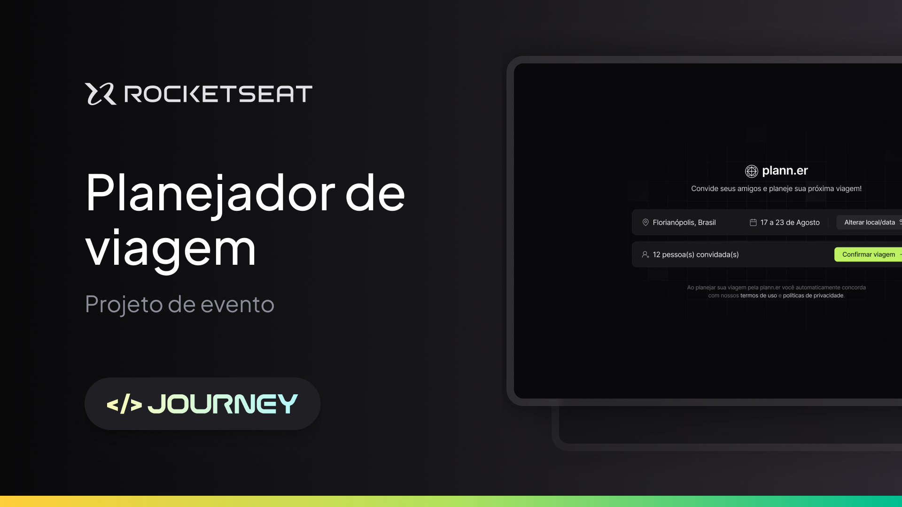
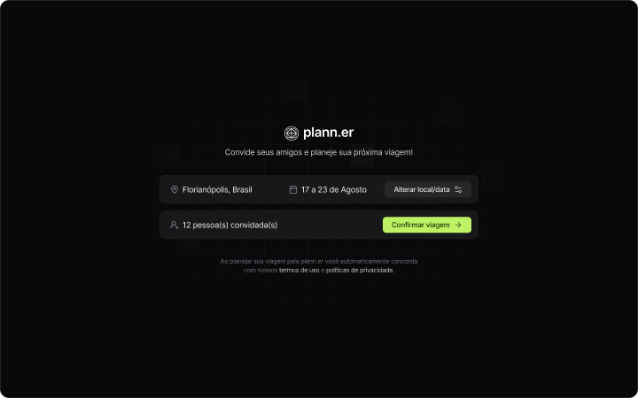

<h1 id="topo" align="center">plann.er</h1>

<div align="center">

</div>

<br>

<div align="center">


</div>

<br>

<div align="center">
<a href="#sobre">Sobre </a>&nbsp;&nbsp;•&nbsp;&nbsp;
<a href="#funcionalidades">Funcionalidades </a>&nbsp;&nbsp;•&nbsp;&nbsp;
<a href="#layout">Layout </a>&nbsp;&nbsp;•&nbsp;&nbsp;
<a href="#tecnologias">Tecnologias </a>&nbsp;&nbsp;•&nbsp;&nbsp;
<a href="#aprendizados">Aprendizados </a>&nbsp;&nbsp;•&nbsp;&nbsp;
<a href="#comoexecutar">Como executar </a>&nbsp;&nbsp;•&nbsp;&nbsp;
<a href="#autor">Autor </a>&nbsp;&nbsp;•&nbsp;&nbsp;
<a href="#licenca">Licença </a>
</div>

<br>

<div id="sobre">
<h2>💻 Sobre o projeto</h1>
  <p>Projeto feito na semana <a href="https://www.rocketseat.com.br/eventos/nlw/convite/thiago-11356">NLW Journey</a> da <a href="www.rocketseat.com.br">Rocketseat</a>.</p>
  <p>
  Plann.er é um site onde você pode criar um planejamento para a sua viagem. Você pode escolher a data, convidar pessoas via e-mail, adicionar tarefas e/ou programação dos dias e entre outras funcionalidades. 
  </p>

</div>

<div id="funcionalidades">
<h2>⚙️ Funcionalidades</h2>

- [x] Página Inicial:

  - [x] Botões para criar uma nova viagem;
  - [x] Convidar pessoas;
  - [X] Confirmar criação de viagem;
    - [x] Ao confirmar, redirecionar para outra página.

- [x] Página da Viagem:
  - [x] Seção de Atividades;
  - [x] Seção de Links;
  - [x] Seção de Convidados.

- [x]  Conexões do Frontend com a API e Backend:
  - [x]  Página Inicial;
  - [ ]  Página da Viagem;
    - [x]  Cadastrar Atividade;
    - [ ]  Alterar local/data;
    - [ ]  Cadastrar novo link;
    - [ ]  Gerenciar convidados.

</div>

<div id="layout">
<h2>🎨 Layout</h2>
<p>O Layout da aplicação está disponível no Figma</p>

<a href="https://www.figma.com/community/file/1392276515495389646">
  
</a>

<h3>Mobile Layout</h3>
<p>Por enquanto não há Layout para Mobile</p>
<!--  -->

<br>

<h3>Desktop Layout</h3>


</div>

<div id="tecnologias">
<h2>🛠 Tecnologias Utilizadas</h2>
<p>As seguintes ferramentas foram usadas na construção do projeto:</p>
<p><strong>Website / Frontend:</strong></p>
<ul>
  <li>Vite</li>
  <li>ReactJs</li>
  <li>TypeScript</li>
  <li>TailwindCSS</li>
</ul>
<br>
<p><strong>Server / Backend:</strong></p>
<ul>
  <li>NodeJs;</li>
  <li>Prisma;</li>
  <li>Fastify;</li>
  <li>Zod;</li>
  <li>Nodemailer.</li>
</ul>
<br>
<p><strong>Utilitários:</strong></p>
<ul>
  <li>Lucide Icons;</li>
  <li>React Routers;</li>
  <li>TailwindCSS Variants;</li>
  <li>React DayPicker;</li>
  <li>Date FNS.</li>
</ul>

</div>

<br>

<div id="aprendizados">
<h2>🌟 Aprendizados</h2>
<h3>Frontend</h3>
<p>Aprendi sobre componentes globais, rotas de páginas, integrar backend com frontend, aprimorei meus conhecimentos 
com useState, melhor organização dos arquivos e entre outros.

<h3>Backend</h3>
<p>Aprendi sobre criação de banco de dados, criar api e rotas, utilizar o Fastify, validação com zod, aprimorei meus conhecimentos com NodeJS e TypeScript, aprendi a validar
as informações do arquivo .env e entre outros.</p>
</p>
</div>

<br>

<div id="comoexecutar">
<h2>📋 Como executar o projeto</h2>
<p>Este projeto é divido em duas partes:</p>
<ol>
  <li>Backend (pasta backend)</li>
  <li>Frontend (pasta frontend)</li>
</ol>
<p>O Frontend precisa que o Backend esteja sendo executado para funcionar.</p>
<h3>Pré-requisitos</h3>
<p>Antes de começar, você vai precisar ter instalado em sua máquina as seguintes ferramentas:</p>
<ul>
  <li>NodeJs</li>
</ul>
<p>Além disto é bom ter um editor para trabalhar com o código como o <strong><a href="https://code.visualstudio.com">VSCode</a></strong>.</p>

<h4>🧰 Rodando o Backend (servidor)</h4>

```bash

# Clone este repositório
$ git clone https://github.com/thiagoguidi1/plann.er.git

# Acesse a pasta do projeto no terminal/cmd
$ cd plann.er

# Vá para a pasta do Backend
$ cd backend

# Instale as dependências
$ npm install

# Renomeie .env-example pra .env

# Execute a aplicação em modo de desenvolvimento
$ npm run dev

# O servidor inciará na porta:3333 - acesse http://localhost:3333

```

<h4>🖥️ Rodando a aplicação web (Frontend)</h4>

```bash

# Acesse a pasta do projeto no seu terminal/cmd
$ cd plann.er

# Vá para a pasta do Frontend
$ cd frontend

# Instale as dependências
$ npm install

# Execute a aplicação em modo de desenvolvimento
$ npm run dev

# A aplicação será aberta na porta que aparecerá no console

#Na pasta backend/.env altere WEB_BASE_URL= para o endereço que apareceu no console

```

</div>

<br>

<div id="autor">
  <h2>🧙‍♂️ Autor</h2>
  <a href="https://github.com/thiagoguidi1">
   
   <br>
   <sub><b>Thiago Guidi</b></sub></a> <a href="https://github.com/thiagoguidi1"></a>
   <br>
</div>

<br>

<div id="licenca">
<h2>📝 Licença</h2>
<p>Esse projeto está sob a <strong><a href="./LICENSE"></a>licença MIT</strong>.</p>

</div>

<br>

<div align="end">
  <a href="#topo">
    
    </a>
</div>

<div align="center">
  <h3>Feito com ❤️ por <a href="https://github.com/thiagoguidi1"><strong>Thiago Guidi</strong>.</a> 
  </div>

  <div align="center">
    <a href="https://www.linkedin.com/in/thiagoguidi"><h4><em>👋🏽 Entre em Contato!</em></h4></a>
  </div>

<br>


